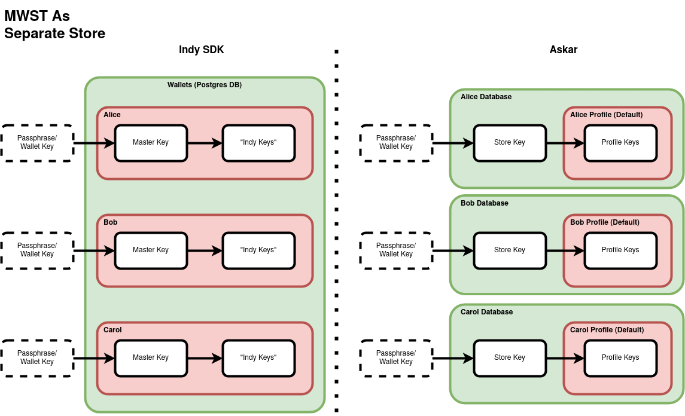
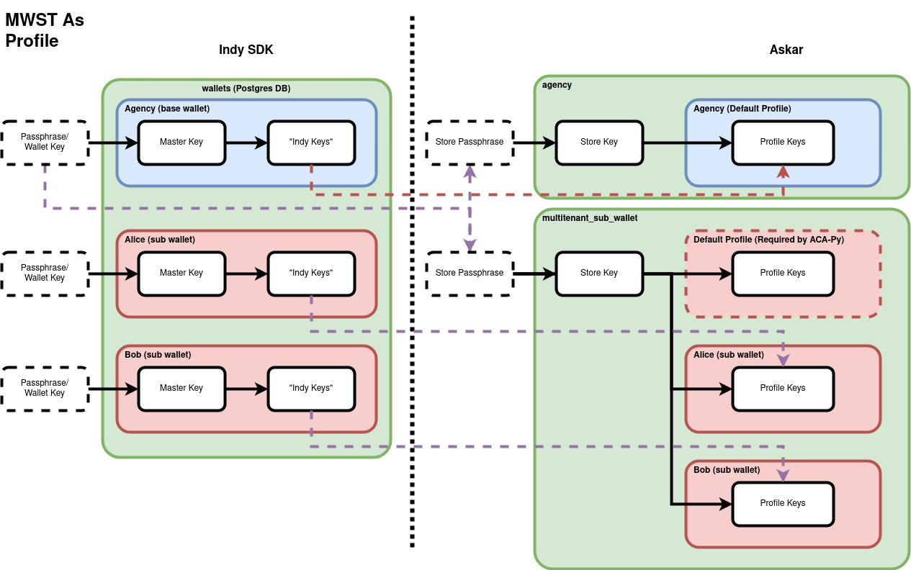

# Migration Script

The purpose of this script is to migrate ACA-Py Indy SDK format storage data into the Aries Askar format. This transition from Indy-SDK to Askar for storage is part of the larger project to eliminate the Indy-SDK in favor of shared components.


## Prerequisites

* Upgrade PostgreSQL wallet database to >= PostgreSQL 11
* Backup data (there are destructive actions in the migration script)
* Upgrade Python version to >= v3.10

## Install

```
poetry install
poetry shell
```


## Developer automated testing

### Intermediate testing

#### Generate database for each migration strategy:
```
cd tests/intermediate/input
make sqlite
make dbpw
make mt-mwst
make mwst
make mt-mwst-leftover-wallet
```

#### Run tests
```
cd ..
pytest
```

## Migration Considerations

There are several considerations for determining the migration strategy for a given database: database type, wallet management mode, and agent type.


### Database Types
* SQLite
* PostreSQL

### Wallet Management Modes
For a PostgreSQL database, the Indy-SDK has multiple wallet management modes to take into account when determining migration strategy. The [Indy-SDK documentation](https://github.com/hyperledger/indy-sdk/tree/main/experimental/plugins/postgres_storage#wallet-management-modes) describes the follow modes:
* `DatabasePerWallet` - each wallet has its own database
* `MultiWalletSingleTable` - all wallets are stored in single table in single database

The third wallet management mode, `MultiWalletSingleTableSharedPool`, functions the same as the `MultiWalletSingleTable` mode for the purposes of this migration, so the two use the same strategy.

For a SQLite database, the only management mode available is `DatabasePerWallet`. Both SQLite databases and PostgreSQL databases that use the `DatabasePerWallet` mode are migrated via the `Dbpw` migration strategy described [below](#databaseperwallet).

### Agent Type

For a PostgreSQL database that uses the `MultiWalletSingleTable` management mode, there are two migration options depending on the type of agent used: standard or multi-tenanted.

#### Standard 

A standard agent refers to an agent that is not multi-tenanted and is un-managed (i.e. there is no hierarchy in which a base wallet holds key to its subwallets). In this case, each wallet in the `MultiWalletSingleTable` setup is translated into a separate Askar store and the unique wallet keys are preserved for each wallet, as shown in the [diagram](#mwst-as-stores-key-diagram). This is optimal for separate users who must only be able ot access their own wallets but want to share resources. The database of a standard agent that uses the `MultiWalletSingleTable` mode is migrated using the `MwstAsStores` strategy described [below](#mwst-as-stores).

##### MWST as stores key diagram


#### Multi-tenanted Agent
For a multi-tenanted agent that uses the `MultiWalletSingleTable` management mode in Indy-SDK, each row in the metadata table corresponds to a subwallet. Each row in the items table has a `wallet_id` identifying which items correspond to which wallet. Each row in the metadata table has a key encrypted using a wallet key, the key derived from the passphrase used to open the wallet.

* Note: While the `DatabasePerWallet` mode is possible for a multi-tenanted agent, this setup is inefficient since a new database is created for every subwallet of the multi-tenanted agent and therefore not recommended. For this reason, this migration script does not support migrating a database that uses the `DatabasePerWallet` mode with multi-tenancy.

Multi-tenancy in ACA-Py when using Askar has different characteristics. Askar does not have a wallet scheme that exactly matches the `MultiWalletSingleTable` mode with multi-tenanted agents in Indy-SDK. The simple multi-tenancy case for Askar more closely resembles the `DatabasePerWallet` setup of the Indy SDK.

Askar supports the concept of profiles where each profile represents a different user. This mode of operation strictly follows a "managed" wallet style in which the owner of the ACA-Py instance can decrypt and use every Askar Profile contained in its Askar Store. The strategy to migrate such a database will translate the `MultiWalletSingleTable` setup into Askar Profiles, where each wallet corresponds to a row in the profiles table. Since this strategy is intended only for the wallets that were subwallets in a multi-tenanted agent, it does not preserve the unique keys for each wallet in the Indy-SDK setup, as shown in the [diagram](#mwst-as-profiles-key-diagram). Instead, the store key for all Askar profiles is derived from the wallet key of the base wallet in Indy-SDK. The database of a multi-tenanted agent that uses the `MultiWalletSingleTable` mode is migrated using the `MwstAsProfiles` strategy described [below](#mwst-as-profiles).

##### MWST as profiles key diagram



## Migration Strategies

### DatabasePerWallet
This strategy implements migration for both SQLite and PostgreSQL database that use the `DatabasePerWallet` management mode.
#### Parameters
* `strategy` - migration strategy (str)
    * Must be `"dbpw"`
* `uri` - URI for the database to be migrated (str)
    * SQLite example: `f"sqlite://{sqlite_alice}"`
    * PostgreSQL example: `f"postgres://{user_name}:{db_user_password}@{db_host}:{db_port}/{db_name}"`
* `wallet_name` - name of the wallet (str)
    * Example: `"alice"`
* `wallet_key` - key corresponding to the wallet (str)
    * Example: `"insecure"`

#### Run
SQLite:
```
askar-upgrade --strategy dbpw --uri sqlite://<path to sqlite db> --wallet-name <wallet name> --wallet-key <wallet key>
```

PostgreSQL:
```
askar-upgrade --strategy dbpw --uri postgres://<username>:<password>@<hostname>:<port>/<dbname> --wallet-name <wallet name> --wallet-key <wallet key>
```


### MWST as Stores
This strategy implements migration for a PostgreSQL database that uses the `MultiWalletSingleTable` management mode for a standard agent.
#### Parameters
* `strategy` - migration strategy (str)
    * Must be `"mwst-as-stores"`
* `uri` - URI for the database to be migrated (str)
    * Example: `f"postgres://{user_name}:{db_user_password}@{db_host}:{db_port}/{db_name}"`
* `wallet_keys` - mapping from wallet name to wallet key for each wallet in the database to be migrated (dict)
    * Example:
```
            {
                "alice": "alice_insecure1",
                "bob": "bob_insecure1",
            }
```

* `allow_missing_wallet` - flag to allow wallets in database to not be migrated (bool)
    * There is a check to ensure that the wallet names passed into the migration script align with the wallet names retrieved from the database to be migrated. If a wallet name is passed in that does not correspond to an existing wallet in the database, an `UpgradeError` is raised. If a wallet name that corresponds to an existing wallet in the database is not passed into the script to be migrated, a `MissingWalletError` is raised. If the user wishes to migrate some, but not all, of the wallets in a `MultiWalletSingleTable` database, they can bypass the `MissingWalletError` by setting the `--allow-missing-wallet` argument as `True`.

#### Run
```
askar-upgrade --strategy mwst-as-stores --uri postgres://<username>:<password>@<hostname>:<port>/<dbname> --wallet-keys <wallet keys>
```


### MWST as Profiles
This strategy implements migration for a PostgreSQL database that uses the `MultiWalletSingleTable` management mode with multi-tenanted agents. The name of the base wallet must be specified because the wallet key of the base wallet becomes the Askar store key for all profiles in the Askar database after migration.

#### Parameters
* `strategy` - migration strategy (str)
    * Must be `"mwst-as-profiles"`
* `uri` - URI for the database to be migrated (str)
    * Example: `f"postgres://{user_name}:{db_user_password}@{db_host}:{db_port}/{db_name}"`
* `base_wallet_name` - name of the base wallet (str)
    * Example: `"agency"`
* `wallet_keys` - mapping from each wallet and subwallet name to its corresponding key (dict)
    * Example:
```
            {
                "agency": "agency_insecure0",
                "alice": "alice_insecure1",
                "bob": "bob_insecure1",
            }
```


#### Run
```
askar-upgrade --strategy mwst-as-profiles --uri postgres://<username>:<password>@<hostname>:<port>/<dbname> --base-wallet-name <base wallet name> --wallet-keys <wallet keys>
```

#### Askar Multitenancy
After migration, the startup command must include the following argument:
```
--multitenancy-config wallet_type=askar-profile
```


## Wallet location

Indy-SDK and Askar store their wallets inside different directories:
- Indy-SDK: `/home/<user>/.indy_client/wallet/<wallet name>`
- Askar: `/home/<user>/.aries_cloudagent/wallet/<wallet name>`

It is left to the user to move their wallet(s) into the desired location.

## Step-by-step Acapy Wallet Migration Guide
0. Stop any agents using the wallet: Before starting the migration process, make sure to stop any agents or applications that are currently using the wallet to avoid any potential conflicts.
1. Backup your current wallet: It is important to create a backup of your current wallet before starting the migration process, in case anything goes wrong.
2. Prepare configuration: The migration script supports migration from Indy SQLite to Aries SQLite or from Indy PostgreSQL to Aries PostgreSQL. Determine which database and [storage plugin](https://github.com/hyperledger/indy-sdk/tree/main/experimental/plugins/postgres_storage#wallet-management-modes) you are using and gather the necessary information for each scenario.
    - Indy SQLite -> Aries SQLite:
        - strategy: dbpw,
        - uri: sqlite://`<path to sqlite db>`,
        - wallet-name: `<name>`,
        - wallet-key: `<password>`,    
    - Indy PostgreSQL single wallet per data store -> Aries PostgreSQL single wallet per data store:
        - strategy: dbpw,
        - uri: postgres://`<user name>`:`<db user password>`@`<db host>`:`<db port>`/`<db name>`,
        - wallet-name: `<name>`,
        - wallet-key: `<password>`,    
    - Indy PostgreSQL multiple wallets in a single table -> Aries PostgreSQL multiple stores, one wallet per data store :
        - strategy: mwst-as-stores,
        - uri: postgres://`<user name>`:`<db user password>`@`<db host>`:`<db port>`/`<db name>`,
        - wallet-name: `<name>`,
        - wallet-key: `<password>`,    
        - base-wallet-name: `<base wallet name>`,
        - base-wallet-key: `<base wallet key>`,
        - wallet-keys: `<path to json file with wallet keys>`,
    - Indy PostgreSQL multiple wallets in a single table -> Aries PostgreSQL single store, one wallet per profile :
        - strategy: mwst-as-profiles,
        - uri: postgres://`<user name>`:`<db user password>`@`<db host>`:`<db port>`/`<db name>`,
        - wallet-name: `<name>`,
        - wallet-key: `<password>`,    
        - base-wallet-name: `<base wallet name>`,
        - base-wallet-key: `<base wallet key>`,
        - wallet-keys: `<path to json file with wallet keys>`,
3. Execute the migration with configuration: Once you have the required information and configuration, execute the migration script. Make sure to follow the instructions carefully and double-check your inputs before starting the migration process, as it is a one-way process.
```
askar-upgrade --strategy dbpw --uri sqlite://<path to sqlite db> --wallet-name <wallet name> --wallet-key <wallet key>
```

Note: Exercise caution and thoroughness during the migration process and make sure to backup your wallet data before starting

### Multiple wallet Edge Cases

- allow-missing-wallet, if you have wallets you do not want to migrate you can exclude them from the wallet keys file, and set this flag to true.
- delete-indy-wallets, set this flag to true to delete wallets that did not migrate.
